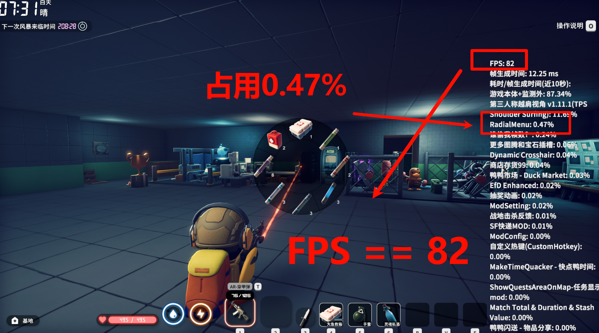

# 🎯 RadialMenu — 逃离鸭科夫（Escape from Duckov）环形菜单模组

> 版本：**v2.0（对应 Steam v2.0最新版）**  
> 这是供无法通过 Steam 订阅/下载模组的玩家使用的仓库说明

---

## 说明 / 简介
RadialMenu 为《逃离鸭科夫》添加一个可自定义的环形快捷盘（radial wheel），支持 6/8 扇区布局、拖拽绑定、智能食物推荐、子弹时间等功能，旨在提升物品使用与切换的流畅度与便捷性。

如果遇到圆盘卡在屏幕上不消失的问题：按一次 **Win（Windows）键** 当游戏窗口失去焦点后，圆盘会自动关闭。

---

## 资源与下载

- **Steam 工作坊（模组主页）**：  
  https://steamcommunity.com/sharedfiles/filedetails/?id=3593171934

- **非 Steam 下载（GitHub）**：  
  https://github.com/fourging/radial-menu

---

## 依赖模组（必须 / 推荐）
- **ModSetting** — 实现模组设置与按键绑定（订阅以启用设置菜单）  
  链接：  
  https://steamcommunity.com/workshop/filedetails/?id=3595729494

- **HarmonyLib（Early Access）** — 用于实现子弹时间效果（如需要子弹时间功能请确保已安装）  
  https://steamcommunity.com/workshop/filedetails/?id=3589088839

---

## 主要功能（Highlights）
- 支持 **6 扇区 / 8 扇区** 两种布局  
- 背包中长按 Q 可进入绑定模式（直观拖拽）  
- 圆盘呼出时可选项开启 **子弹时间**（可调速率）  
- **智能食物推荐**：根据当前饥渴与状态推荐最合适物品  
- 完全的 UI 自定义能力（替换贴图、主题支持）  
- 低性能开销：不呼出时基本不占用资源

---

## 快速安装（非 Steam 用户）
1. 从上方 GitHub 链接下载 ZIP 并解压（或 `git clone`）。  
2. 将 `RadialMenu` 文件夹（整个模组目录）放入游戏目录：  <Escape from Duckov>/Duckov_Data/Mods/RadialMenu
3. 确保依赖模组已安装并启用（若使用 Steam，请通过工作坊订阅依赖项）。  
4. 启动游戏并进入模组设置调整按键 / UI / 其他选项。

---

## 使用说明

### 绑定物品
1. 打开背包界面。  
2. 选中要绑定的物品（物品方框高亮）。  
3. **长按 Q（默认 0.25s）** 呼出绑定面板。  
4. 移动鼠标到目标扇区，松开 Q 完成绑定。

### 使用物品
- 游戏中 **长按 Q** 呼出圆盘菜单 → 指向扇区 → 松开 Q 使用绑定物品。

### 查找最低价物品
- 在背包界面 **短按 Q**（不选中物品）会触发最低价/价重比提示。

---

## 自定义 UI（贴图替换）
模组支持替换 1024×1024 的贴图文件。把替换图片放入模组的 `texture` 文件夹，文件名必须与默认保持一致的格式。

**支持的文件名示例：**
A6Background.png
A6Sector0.png ... A6Sector5.png # 6 扇区 A 套
B6Background.png
B6Sector0.png ... B6Sector5.png # 6 扇区 B 套
C8Background.png
C8Sector0.png ... C8Sector7.png # 8 扇区 C 套

---

## 配置建议（推荐项）
- 若使用第一人称视角，**在模组设置中开启“第一人称适配”** 以获得更合理的显示位置与交互体验。    
- UI 缩放与图标尺寸：若遇贴图边缘白边问题，请确保自定义贴图为 **完整透明 PNG** 且尺寸为 1024×1024。

---

## 性能与兼容性
- 常驻内存占用极低；仅在呼出时渲染 UI。  
- 与常见性能监控类模组（如 “谁偷我帧数？”）兼容良好。  
- 如与其他模组冲突，优先检查加载顺序与按键绑定是否重复。

---

## 更新日志（Changelog）

**🎉 v2.0 - 最新版本**
- 新增支持智能滚轮模组，现在可以无缝使用智能滚轮模组了
- 添加智能滚轮模组兼容性解决方案
- 更新按键ZX切换页面
- 修复使用食物逻辑，优先使用低耐久食物
- 优化后的食物推荐算法
- 优化代码逻辑，提升稳定性

**🎉 v1.9**
- 新增日语（ChatGPT）和韩语翻译
- 修改爆炸投掷物判断，现在会识别屎球了。
- 更新自动绑定食物扇区的食物判断方法，现在会将粑粑识别为食物了。
- 减少医疗包使用的时候提示的小数点位数
- 增加使用可乐，酒，屎的食用提示语音

**🎉 v1.8**
- 新增药品菜单和爆炸物菜单，呼出圆盘之后滚动鼠标滚轮即可切换
- 优化绑定物品排序逻辑，确保主菜单中绑定物品排在末尾，防止占用药品菜单中本就不多的位置
- 优化不同菜单之间的切换效果，保证美观视效。
- 优化不同菜单之间的切换手感，保证流畅操作。
- 优化第一人称或越肩视角下，圆盘菜单自动关闭瞄准准星，防止遮挡物品名称
- 优化第一人称或越肩视角或圆盘固定中心模式下，移动鼠标选择扇区的操作手感，优化了移动算法
- 优化代码逻辑，提升稳定性
- 修复陈年旧疾，现在可以储存绑定信息直到下次启动游戏了

**🎉 v1.7**
- 更换依赖设置模组
- 修复由于贴图UI加载方式导致的UI背景白边
- 增加第一人称模组适配，增加越肩视角适配

**🎉 v1.6**
- 新增绑定按钮设置
- 新增多语言支持
- 优化代码逻辑，提升稳定性

**🎉 v1.5**
- 完整适配ModConfig配置菜单模组
- 完全开放UI自定义功能
- 优化食物推荐算法，更加智能精准
- 优化代码逻辑，提升稳定性
- 基本完成所有预期功能

**🔧 v1.4**
- 优化代码结构，修复多个小bug
- 初步适配配置菜单模组
- 新增UI大小、死区大小等自定义选项

**🍎 v1.3**
- 新增最低价重比物品提示功能
- 优化自动绑定食物逻辑
- 增加物品剩余数量语音提示
- 添加部分物品的趣味彩蛋对白

**💊 v1.2**
- 修复使用急救箱时的随机选中问题
- 现在优先使用耐久度最低的急救箱
- 修复不同分辨率下UI缩放异常问题
- 新增5号扇区自动绑定最低价食物功能

**🎯 v1.1**
- 增加语言输出功能
- 小人会提示当前剩余物品数量
- 部分物品添加有趣的小彩蛋对白

---

## 致谢
- 感谢 **EfD Enhanced** 作者 Doro Doro Mi（其开源实现参考大量逻辑）。  
  https://steamcommunity.com/sharedfiles/filedetails/?id=3590346461
- 感谢模组作者 **土豆宝** 的指导：  
  https://steamcommunity.com/profiles/76561198053835373
- 感谢 UI 贡献者 **Owenism**：  
  https://steamcommunity.com/id/Owenism
- 感谢所有参与测试与反馈的玩家。

---

## 📜 声明
- 本模组绝大部分代码依赖AI生成，作者本人并非计算机专业
- 作者仅熟悉Python，C#是为制作此模组才开始学习的,请不要期待我写出优雅的代码
- 目前暂未发现重大bug，如有问题欢迎反馈
- 本模组仅供学习交流使用，请勿用于商业用途

---

## 标签（Tags）
`环形菜单` `快捷栏` `快速使用物品` `UI 美化` `智能推荐` `子弹时间` `自定义界面`

---

**Enjoy 更流畅的鸭科夫冒险！**  
如果喜欢此模组，欢迎在仓库或工作坊页面点个 ⭐ 支持作者。

